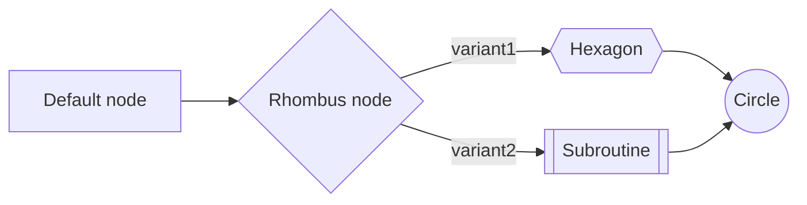

# Mermaid Charting
.NET lib for generate Mermaid diagrams and charts

## Example

```csharp
string flowchart = new FlowchartBuilder()
    .SetDirection(FlowchartDirection.LeftToRight)
    .AddNode(new NodeModel("1", "Default node"))
    .AddNode(new NodeModel("2", "Rhombus node", NodeType.Rhombus))
    .AddNode(new NodeModel("3", "Hexagon", NodeType.Hexagon))
    .AddNode(new NodeModel("4", "Subroutine", NodeType.Subroutine))
    .AddNode(new NodeModel("5", "Circle", NodeType.Circle))
    .AddLink(new LinkModel("1", "2"))
    .AddLink(new LinkModel("2", "3", "variant1"))
    .AddLink(new LinkModel("2", "4", "variant2"))
    .AddLink(new LinkModel("3", "5"))
    .AddLink(new LinkModel("4", "5"))
    .Build();
```

### Result

